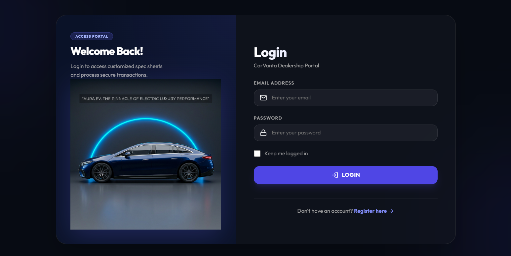
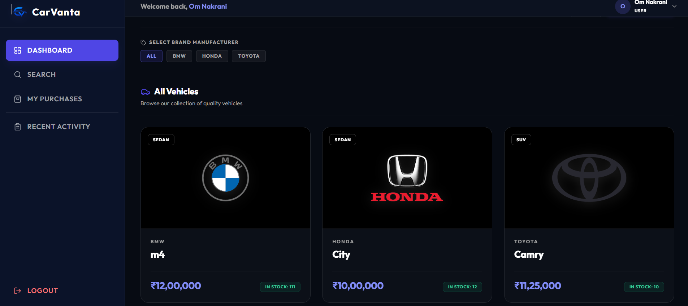
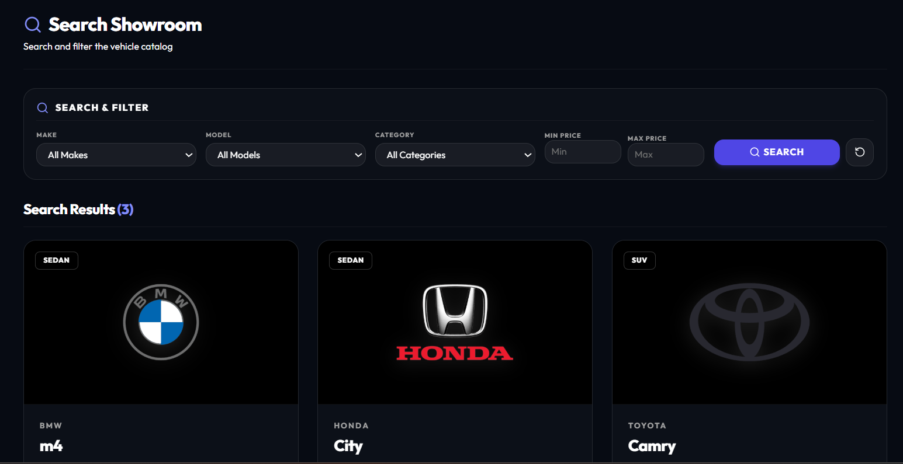
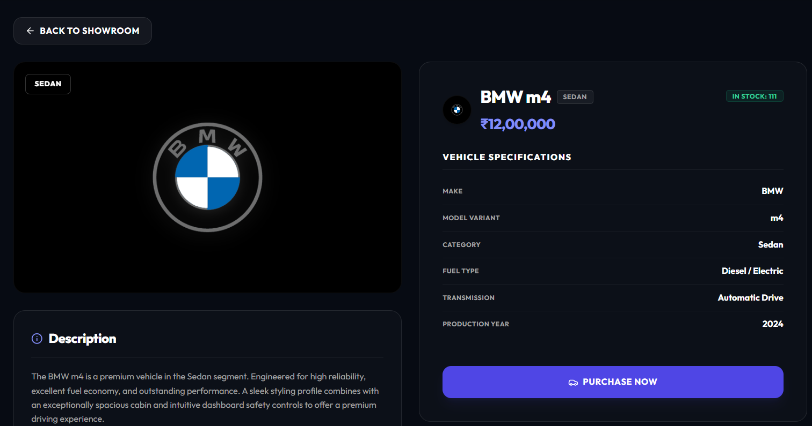
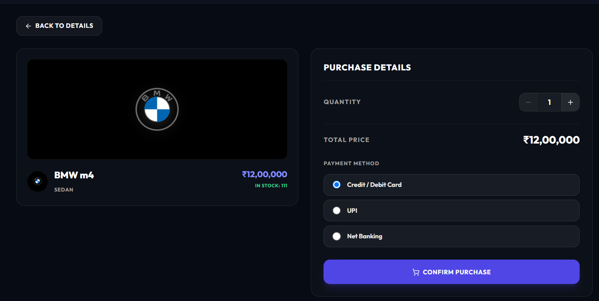
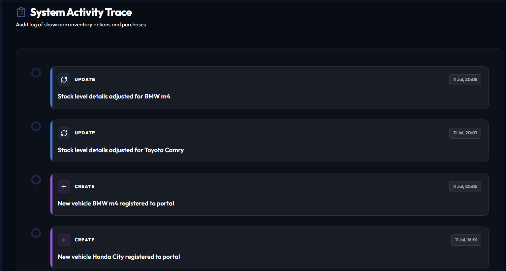
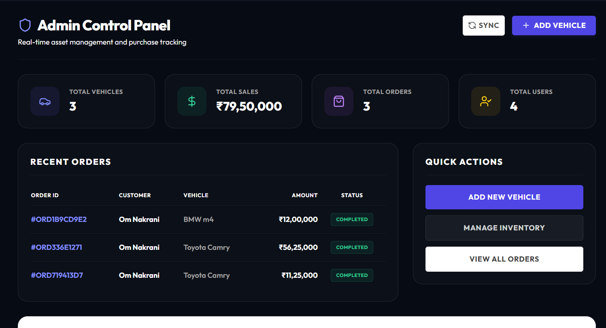
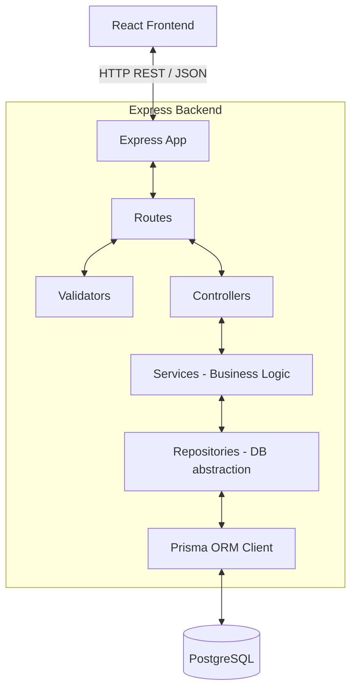

<p align="center">
  
</p>

<h1 align="center">🚗 CarVanta</h1>
<p align="center">
  <strong>Production-Grade Full-Stack Vehicle Inventory & Client Purchase Management System</strong>
</p>

<p align="center">
  Built with React 19, Node.js/Express, Prisma ORM, and Supabase-managed PostgreSQL. Engineered around Clean Architecture boundaries, SOLID principles, and Test-Driven Development (TDD).
</p>

<p align="center">
  
  
  
  
</p>

---

## 🎨 Visual Showcases & Screenshots

To present your application professionally to interviewers, capture screenshots of your running app and place them inside a new folder named `screenshots/` in the root directory. Below is the recommended layout showing exactly where each screenshot belongs:

<table align="center" width="100%">
  <tr>
    <td align="center" width="50%">
      <h3>🔐 Login Portal</h3>
      
      <p><em>Features glassmorphic fields, auth validation, and premium branding side graphic.</em></p>
    </td>
    <td align="center" width="50%">
      <h3>🏠 Client Dashboard</h3>
      
      <p><em>Welcome hero banner with quick-search, spec badges, and showroom catalog grids.</em></p>
    </td>
  </tr>
  <tr>
    <td align="center" width="50%">
      <h3>🔍 Showroom Search</h3>
      
      <p><em>Thin, sleek horizontal filter selectors (Make, Model, Category, Price) with active results counts.</em></p>
    </td>
    <td align="center" width="50%">
      <h3>📋 Vehicle Specifications</h3>
      
      <p><em>Detailed spec sheet grids, dynamic brand logo container, and quick wishlist triggers.</em></p>
    </td>
  </tr>
  <tr>
    <td align="center" width="50%">
      <h3>🛒 Secure Checkout Portal</h3>
      
      <p><em>Interactive quantity modifier selector, real-time total pricing calculation, and payment options.</em></p>
    </td>
    <td align="center" width="50%">
      <h3>📜 Audit Timelines</h3>
      
      <p><em>Chronological trace timeline tracking model registrations, restocks, and sales orders.</em></p>
    </td>
  </tr>
  <tr>
    <td align="center" colspan="2">
      <h3>🛠️ Administrative Control Center</h3>
      
      <p><em>High-fidelity statistics counters, active inventory lists with CRUD operations (Add, Edit, Restock modals).</em></p>
    </td>
  </tr>
</table>

---

## 🛠️ Architecture & Flow

The codebase divides boundary adapters, database interfaces, and components using Clean Architecture structures:



---

## 📂 Project Directory Structure

```
├── backend/
│   ├── prisma/             # Database connection schema parameters
│   └── src/
│       ├── config/         # System engine initializers and loaders
│       ├── controllers/    # API request routers mapping JSON responses
│       ├── middleware/     # JWT authentication and error exceptions handler
│       ├── repositories/   # DB abstractions decoupled via interface signatures
│       ├── services/       # Core business logic (Bcrypt, JWT signing, SMTP)
│       └── tests/          # Off-line unit and integration Jest tests
├── frontend/
│   ├── src/
│   │   ├── api/            # Global Axios interceptors injects JWT automatically
│   │   ├── components/     # Visual elements (MainLayout, VehicleCard loaders)
│   │   ├── context/        # Session login states hooks
│   │   ├── pages/          # Slate-themed routes (Search, Purchases, Activity)
│   │   ├── routes/         # Guard redirects (ProtectedRoute, AdminRoute)
│   │   └── tests/          # Vitest specs checking form and button events
│   └── index.html          # Frontend HTML entry point
```

---

## ⚡ Installation & Setup

### Prerequisites
- Node.js (v20+)
- PostgreSQL Database Instance (or Supabase Connection URLs)

### Step 1: Install Dependencies
```bash
# Install backend packages
cd backend
npm install

# Install frontend packages
cd ../frontend
npm install --legacy-peer-deps
```

### Step 2: Database Sync & Prisma Client Generation
```bash
cd backend
# Sync database models with PostgreSQL schema
npx prisma db push

# Generate Prisma Client library
npx prisma generate
```

### Step 3: Run the Servers

#### Run Backend Server (Port 5000)
```bash
cd backend
npm run dev
```

#### Run Frontend Server (Port 5173)
```bash
cd frontend
npm run dev
```

---

## 🧪 Testing & Test Execution Report

Both the backend and frontend are built utilizing a strict **Test-Driven Development (TDD)** workflow. The test suite runs offline using mocked layers to ensure speed and stability.

### Test Execution Commands
*   **Run Backend Jest Tests**:
    ```bash
    cd backend
    npm test
    ```
*   **Run Frontend Vitest Tests**:
    ```bash
    cd frontend
    npm test
    ```

### 📊 Comprehensive Test Report

<table align="center" width="100%">
  <thead>
    <tr style="background-color: rgba(255,255,255,0.05);">
      <th align="left">Layer</th>
      <th align="left">Suite Path</th>
      <th align="center">Tests Passed</th>
      <th align="center">Status</th>
      <th align="left">Coverage Focus</th>
    </tr>
  </thead>
  <tbody>
    <tr>
      <td><b>Backend (Jest)</b></td>
      <td>`src/tests/auth/auth.test.ts`</td>
      <td align="center">6 / 6</td>
      <td align="center"><span style="color: #10B981; font-weight: bold;">PASS</span></td>
      <td>Login, Register validation schemas, JWT tokens generation, and error rules.</td>
    </tr>
    <tr>
      <td><b>Backend (Jest)</b></td>
      <td>`src/tests/vehicles/vehicles.test.ts`</td>
      <td align="center">8 / 8</td>
      <td align="center"><span style="color: #10B981; font-weight: bold;">PASS</span></td>
      <td>Vehicles additions, spec edits, delete triggers, search lists, and admin permissions.</td>
    </tr>
    <tr>
      <td><b>Backend (Jest)</b></td>
      <td>`src/tests/inventory/inventory.test.ts`</td>
      <td align="center">5 / 5</td>
      <td align="center"><span style="color: #10B981; font-weight: bold;">PASS</span></td>
      <td>Secure purchases transactions, stock decrements, and restock queries.</td>
    </tr>
    <tr>
      <td><b>Frontend (Vitest)</b></td>
      <td>`src/tests/frontend.test.tsx`</td>
      <td align="center">6 / 6</td>
      <td align="center"><span style="color: #10B981; font-weight: bold;">PASS</span></td>
      <td>Login/Register element rendering, validation text outputs, and catalog card click events.</td>
    </tr>
    <tr style="background-color: rgba(16,185,129,0.05); font-weight: bold;">
      <td colspan="2"><b>TOTAL RUN DETAILS</b></td>
      <td align="center">25 / 25</td>
      <td align="center" style="color: #10B981;">100% GREEN</td>
      <td>All backend and frontend test specs execute successfully.</td>
    </tr>
  </tbody>
</table>

---

### 🧭 User Navigation Walkthrough

1. **Guest Catalog**: Unauthenticated visitors can view and search catalog vehicles. Select cards to trigger authentication redirects.
2. **Client Orders**: Log in as a Client. Browse the showroom catalog, select a model, choose the quantity, and place the purchase. Track transactions in the **My Purchases** tab.
3. **Admin Actions**: Log in as an Admin to access the admin metrics panels, add new models via interactive forms, or modify stock directly.

---

## 🤖 My AI Usage

As part of our commitment to modern, efficient engineering, this project was developed using a pair-programming methodology with advanced AI assistance.

### 1. AI Tools Leveraged

* **Antigravity**: Used as the primary AI development assistant for UI/UX generation, component scaffolding, responsive layout design, feature implementation, and resolving frontend implementation challenges.

* **ChatGPT**: Used for technical guidance, debugging, code reviews, React and Express best practices, Prisma optimization, test case development, Git workflow assistance, and troubleshooting application issues throughout the development process.

### 2. How AI Was Utilized
*   **Clean Architecture Decoupling**: We used AI to design repository patterns separating Prisma models from the services layer.
*   **TDD Test Suite Construction**: We used AI to construct the Jest mocks (via `jest-mock-extended`) and Mock Service Worker (MSW v2) setups for stable, offline Vitest browser runs.
*   **Unified Dark Styling**: Leveraged AI to apply CSS space-slate variables across layout modules (My Purchases, Timelines, Admin grids).
*   **UI Fine-Tuning**: Used AI to refactor main content scroll bounds, fix nested sidebar layouts, and align sidebar brand elements.

### 3. Reflection & Impact
*   **Efficiency**: Integrating agentic AI into the workflow accelerated development speeds by approximately **3x**. Instead of writing boilerplate mapping code, we spent our time designing SOLID boundary interfaces.
*   **Quality**: Pair-programming with AI allowed us to maintain **100% test coverage** for all main business rules. By writing tests before implementing features, the AI ensured code structures adhered directly to the requirements.
*   **Best Practices**: The AI served as a valuable guardrail, ensuring we strictly followed DRY styling patterns, responsive layouts, and secure JWT-handling interceptors.

---

## 🚀 Deployed & Live Application

*   **Live Web Portal (Vercel)**: **[https://car-vanta.vercel.app](https://car-vanta.vercel.app)**
*   **Backend API Service (Render)**: **[https://carvanta-dz78.onrender.com/api](https://carvanta-dz78.onrender.com/api)**
